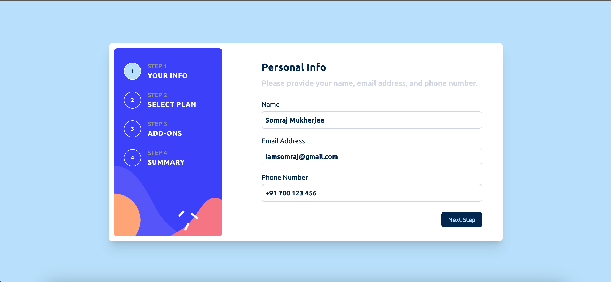
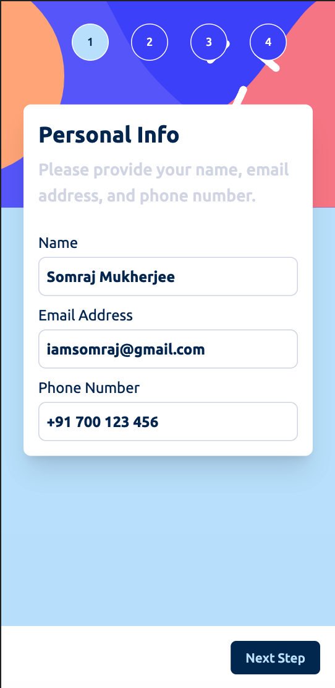

# Multi-Step Form (Frontend Mentor)

This is a solution to the [Multi-step form challenge on Frontend Mentor](https://www.frontendmentor.io/challenges/multistep-form-YVAnSdqQBJ). The challenge required building a multi-step form that closely resembles the provided design. In my implementation, I chose to use React, TypeScript, Tailwind and Redux Toolkit. I specifically opted for Redux Toolkit as I wanted to enhance my understanding and usage of Redux.

## Flow

- Complete each step of the sequence
- Go back to a previous step to update selections
- See a summary of selections on the final step and confirm the order
- View the optimal layout for different screen sizes
- See hover and focus states for interactive elements

## Preview

You can preview the completed project [here](https://form-frontend-mentor.vercel.app/).

## Tech Stack

The project uses the following technologies:

- REACT
- TAILWIND
- REDUX TOOLKIT
- TYPESCRIPT

## Screenshots

<em>Desktop Preview</em>

<em>Mobile Preview</em>

## Credits

This project is based on the [Multi-step form challenge](https://www.frontendmentor.io/challenges/multistep-form-YVAnSdqQBJ) from Frontend Mentor.

## License

This project is licensed under the [MIT License](https://choosealicense.com/licenses/mit/).

## Feedback

If you have any feedback or suggestions, please feel free to reach out to me at [iamsomraj@gmail.com](mailto:iamsomraj@gmail.com).
